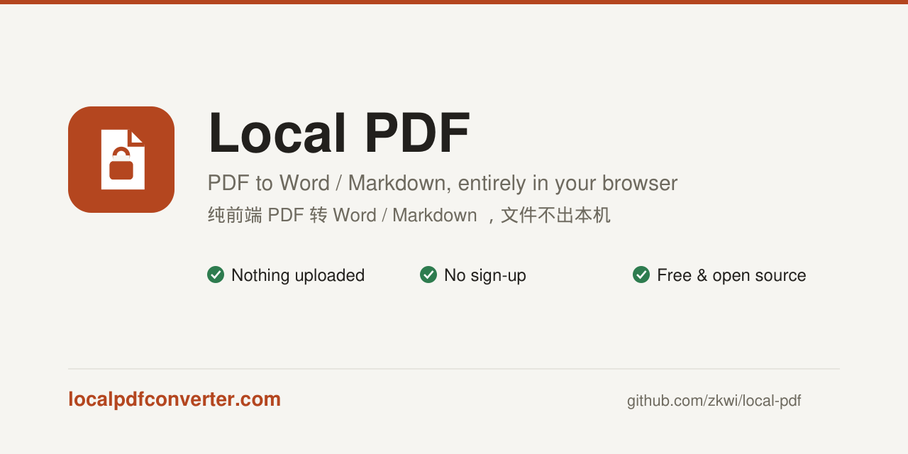
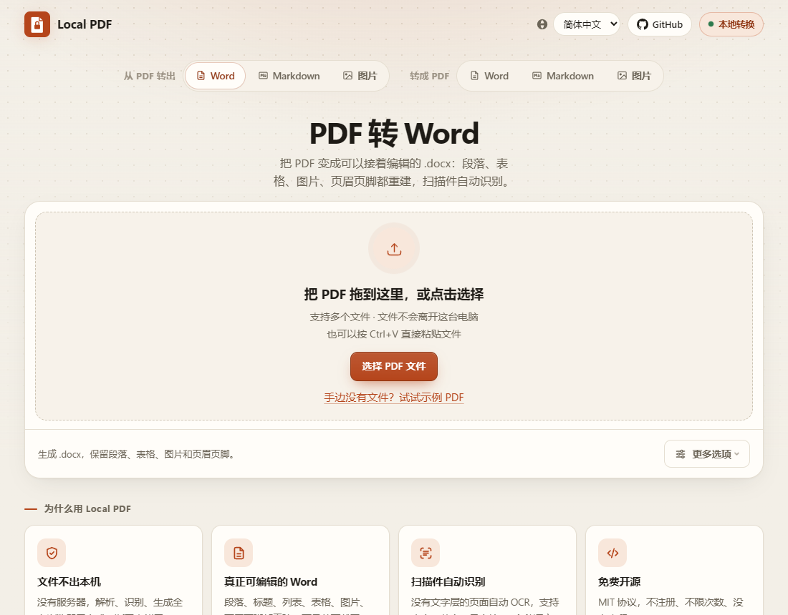

<p align="center">
  <a href="https://localpdfconverter.com"></a>
</p>

<h1 align="center">Local PDF</h1>

<p align="center">
  <b>Convert PDF to Word, Markdown and images, and Word, Markdown and images to PDF, entirely in your browser.</b><br>
  Nothing uploaded · No sign-up · Free &amp; open source
</p>

<p align="center">
  <a href="https://localpdfconverter.com"><b>Try it now →</b></a> ·
  <a href="README.zh-CN.md">简体中文</a> ·
  <a href="CHANGELOG.md">Changelog</a>
</p>

<p align="center">
  <a href="https://github.com/zkwi/local-pdf/actions/workflows/ci.yml"></a>
  <a href="LICENSE"></a>
  
</p>

<p align="center">
  <a href="https://localpdfconverter.com/">PDF to Word</a> ·
  <a href="https://localpdfconverter.com/pdf-to-markdown">PDF to Markdown</a> ·
  <a href="https://localpdfconverter.com/pdf-to-images">PDF to Images</a> ·
  <a href="https://localpdfconverter.com/word-to-pdf">Word to PDF</a> ·
  <a href="https://localpdfconverter.com/markdown-to-pdf">Markdown to PDF</a> ·
  <a href="https://localpdfconverter.com/images-to-pdf">Images to PDF</a>
</p>

## Why Local PDF

- **Private by construction.** There is no server to upload to. Parsing, layout analysis, OCR and file
  generation all run inside the browser; you can confirm it in the network panel. Contracts, statements
  and papers never leave your computer.
- **Real Word documents, not pictures of pages.** Paragraphs, headings, lists, ruled tables with merged
  cells, images, headers/footers and page-number fields are rebuilt so you can keep editing.
- **Scanned PDFs just work.** Pages without a text layer are recognised with PaddleOCR (PP-OCRv6) in the
  browser, per page, in Chinese, English, Japanese and 50+ other languages. Tall "long image" PDFs are handled too.
- **Markdown as well.** The same recognition result can be exported as Markdown, zipped with images and a
  manifest of coordinates and confidence.
- **The other direction too.** Word, Markdown and images become PDFs in the same tab: the browser lays the
  document out, Local PDF writes a small vector PDF with selectable text. Six tools, each with its own URL:
  `/` (PDF → Word), `/pdf-to-markdown`, `/pdf-to-images`, `/word-to-pdf`, `/markdown-to-pdf`, `/images-to-pdf`.
- **Honest about quality.** Every file comes with a conversion report: confidence per page, element counts,
  and warnings that tell you which pages deserve a second look.
- **No install, works offline.** Static site, four interface languages, model files cached after first use.



## Features

| Capability                           | Notes                                                                       |
| ------------------------------------ | --------------------------------------------------------------------------- |
| PDF → Word (.docx)                   | Paragraphs, headings, lists, ruled tables (incl. rules-only tables), images |
| PDF → Markdown                       | Same recognition result; zipped with images and a `manifest.json`           |
| PDF → Images (PNG / JPEG)            | Every page, or a page range such as `1-3, 5, 8-`, rendered at 96, 150 or 300 DPI; zipped when there is more than one |
| Word → PDF                           | The .docx is laid out in the browser and written as a vector PDF: selectable text, headers/footers, numbering, tables, images; no embedded fonts |
| Markdown → PDF                       | GFM tables, task lists, code blocks, quotes; drop the referenced images alongside the .md, or paste text |
| Images → PDF                         | Drag thumbnails to reorder, rotate, pick paper / margins / quality; JPEG originals embedded as-is  |
| Multi-column reading order           | XY-cut page segmentation, cross-column headings handled                     |
| CJK-aware text joining               | No stray spaces between Chinese characters; hyphenated Latin words rejoined |
| Headers, footers, page numbers       | Detected across pages; page numbers become a Word `PAGE` field              |
| Scanned pages (OCR)                  | PaddleOCR PP-OCRv6, decided per page; native text always wins; ruled tables in scans are rebuilt; oversized scans and phone screenshots are scaled to A4 |
| Interface languages                  | 简体中文 · 繁體中文 · English · 日本語                                      |
| Password-protected PDFs, batch queue | Progress, cancellation, per-file conversion report; "Download all" packs the results into one zip |
| Drop anything anywhere               | A file dropped on the wrong tool page opens the right tool; settings are remembered and tool badges show retained work |

What it deliberately does **not** do: tables with no ruling lines at all (misdetection costs more than it helps),
font embedding, editable formulas, vertical text (flattened with a warning), text colour.
Page counts are not preserved either: every PDF page ends with a page break, so text that overflows after font
substitution spills onto an extra page.

Long scan regions are kept as images so charts survive; duplicate OCR text in those regions is omitted.
The report marks their text as non-editable. Turn off “Keep images” and retry when you need text instead.
Scanned text and layout still need checking against the original.

Word / Markdown to PDF only reads local images; external images and unsafe HTML are blocked. Unsupported
EMF/WMF images get a placeholder and advice to replace them with PNG/JPEG. Supplementary-plane characters
and emoji get a `□` placeholder and a visible count; these fonts are not embedded.

## Quick start

```bash
npm install
npm run dev
```

Open <http://localhost:5173> and drop a PDF in.

```bash
npm run build       # typecheck + bundle into dist/
npm run preview     # serve dist/ locally
npm test            # unit tests (layout engine, OCR mapping, Markdown, i18n)
npm run check       # complete local/CI quality gate
npm run ocr-models  # optional: download OCR models into public/ocr-models/ for self-hosting
```

`dist/` is a static site. Put it on any static host (Cloudflare Pages, GitHub Pages, S3, nginx…);
`base` is relative, so subdirectories work. It must be served over **http(s)**; OCR does not start from `file://`.

## OCR

The engine is [PaddleOCR.js](https://github.com/PaddlePaddle/PaddleOCR/tree/main/paddleocr-js)
(official browser SDK, Apache-2.0) with PP-OCRv6, one model covering Chinese, English, Japanese and ~50 other languages.

| Setting            | Model          | First-time download                | Use for                   |
| ------------------ | -------------- | ---------------------------------- | ------------------------- |
| Standard (default) | PP-OCRv6 tiny  | 6 MB model + ~11 MB runtime (gzip) | ordinary scans            |
| High               | PP-OCRv6 small | 31 MB model + ~11 MB runtime       | small print, blurry pages |

- OCR runs only on pages that need it: no text layer, almost no text over a large image, a page that is one big
  image whose only text is a watermark, header/footer or page number, or a garbled text layer.
- Models are downloaded on first use, verified against SHA-256 and kept in Cache Storage; they work offline afterwards.
  The UI shows what is cached and can clear it.
- The ONNX Runtime WASM (26.5 MiB) is loaded from jsDelivr, pinned to the exact version the SDK was built with,
  because it exceeds the 25 MiB single-file limit of Cloudflare Pages and similar hosts.
- To avoid any third-party request, run `npm run ocr-models` (or `npm run ocr-models small` / `all`) and
  `npm run ocr-runtime` before building: the app prefers `public/ocr-models/` and `public/ort/` when present
  (the latter needs a host without the 25 MiB limit).
- Multi-threaded inference needs cross-origin isolation. It is off by default; add
  `Cross-Origin-Opener-Policy: same-origin` and `Cross-Origin-Embedder-Policy: require-corp` to enable it
  (`public/_headers` has the lines commented out). With COEP the models must be self-hosted.

## Deploy

The site is static. On Cloudflare (Workers & Pages → Create → Workers → Import a repository): connect the GitHub
repo, build command `npm run build`, deploy command `npx wrangler deploy`. `wrangler.jsonc` declares an assets-only
Worker serving `dist/` and binds the custom domain; Node 22 comes from `.node-version`. `public/_headers` sets cache
headers and has the optional COOP/COEP lines for multi-threaded OCR commented out. Any other static host works the
same way with `dist/` as the output directory.

`npm run build` also writes one static HTML per tool (`dist/word-to-pdf.html` and so on) with its own title,
description, canonical and hreflang tags, generated by `scripts/prerender-tools.mjs` from the message tables.
Hosts that map `/word-to-pdf` to `word-to-pdf.html` (Cloudflare does by default) serve it to crawlers; others fall
back to `index.html` and the app works the same. The build also copies `index.html` to `dist/404.html`, which
`wrangler.jsonc` serves with a real 404 status for unknown paths.

The site URL is hard-coded in a few SEO places: canonical/hreflang/Open Graph tags in `index.html`, `public/robots.txt`,
`public/sitemap.xml`, `SITE_URL` in `src/ui/SeoContent.tsx` and in `scripts/prerender-tools.mjs`. Change them when
hosting under another domain.

## Privacy

- No upload code exists. Check the network panel: the only external requests are the optional OCR model and runtime downloads.
- pdf.js CMaps, standard fonts and WASM are self-hosted (copied into `public/` on `npm install`).
- Nothing about the document (name, text, page count) is sent anywhere. There is no analytics.

## Browser support

Chrome / Edge 94+, Firefox 105+, Safari 16.4+. The app checks for Web Workers, WebAssembly (with SIMD) and
OffscreenCanvas on start-up: unsupported browsers get a notice, phones get a "better on a computer" page they can
dismiss, and browsers without WASM SIMD keep working with OCR disabled.

## How it works

```text
PDF ──pdf.js──▶ PrimitiveDocument ──layout engine──▶ LayoutDocument ──▶ SemanticDocument ──┬─▶ docx.js ──▶ .docx
                     ▲                                                                       └─▶ remark  ──▶ .md
        scanned page ─┘ PaddleOCR.js
```

Three intermediate models with strict boundaries; the layout engine is pure functions and is unit-tested
without real PDFs. The core never produces natural language: progress, warnings and errors are keys with
parameters, rendered by the UI in the current language.

```text
src/
├─ core/            # conversion engine, no React dependency
│  ├─ contracts/    # the three intermediate models
│  ├─ pdf/          # pdf.js adapter: text, vector segments, images, rendering
│  ├─ layout/       # lines, columns, paragraphs, tables, headers/footers
│  ├─ semantic/     # layout → document semantics
│  ├─ docx/ markdown/ ocr/ converter/
├─ worker/          # Web Worker and message protocol
├─ i18n/            # locale detection and the four message tables
├─ ui/ hooks/       # React UI, capability detection
scripts/            # asset copying, model download
tests/              # unit tests + PDF fixtures
docs/               # architecture, intermediate model, ADRs (in Chinese)
```

Design notes: [docs/ARCHITECTURE.md](docs/ARCHITECTURE.md), [docs/DOCUMENT_IR.md](docs/DOCUMENT_IR.md),
decisions in [docs/adr/](docs/adr/). Roadmap: [docs/ROADMAP.md](docs/ROADMAP.md).

## Development

- TypeScript strict; `npm run typecheck` doubles as the linter. Prettier: `npm run format`.
- Run `npm run check` before pushing; CI executes the same format, test, type, and build gate.
- Tests: `npm test`. Layout algorithms take hand-built spans, so no PDF is needed.
  The PDF fixtures in `tests/fixtures/` are generated by `make_fixtures.py` (needs PyMuPDF locally; not a project dependency).
- Adding a warning or progress message means adding it to all four tables in `src/i18n/messages/`; the type checker enforces it.
- CI runs format check, typecheck, tests and build on every push.
- `public/samples/demo.pdf` is a neutral English sample shared by every UI language. It is generated by `scripts/make-demo-pdf.py`, which needs PyMuPDF locally.
- `docs/social-card.png` (English; also copied to `public/og.png`) and `docs/social-card.zh-CN.png` come from
  `scripts/make-social-card.py` (also PyMuPDF).
- The README screenshots are 1100×860 captures of the preview build, English by default:
  `playwright screenshot --viewport-size="1100,860" --wait-for-timeout=3000 "http://localhost:4173/?lang=en" docs/screenshot.png`,
  and the same with `?lang=zh-CN` for `docs/screenshot.zh-CN.png`.

See [CONTRIBUTING.md](CONTRIBUTING.md) for project boundaries and [docs/TESTING.md](docs/TESTING.md) for fixture tiers, browser checks, and private-sample rules.

Issues and pull requests are welcome. A failed conversion shows a "Report this problem" button and every
conversion report ends with "Output looks wrong? Report it"; both open a GitHub issue prefilled with the version,
browser and diagnostics, never your file. Please keep changes small and focused; this is a personal project and
simplicity is a feature.

## License

MIT. Third-party licenses: [THIRD_PARTY_LICENSES.md](THIRD_PARTY_LICENSES.md).
